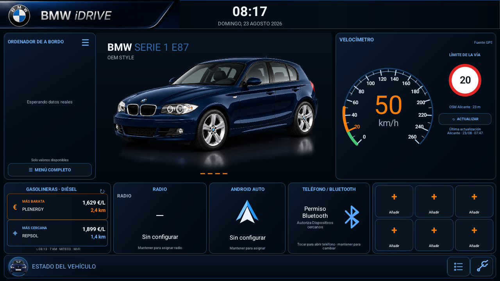
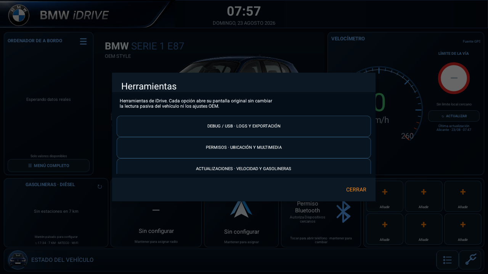
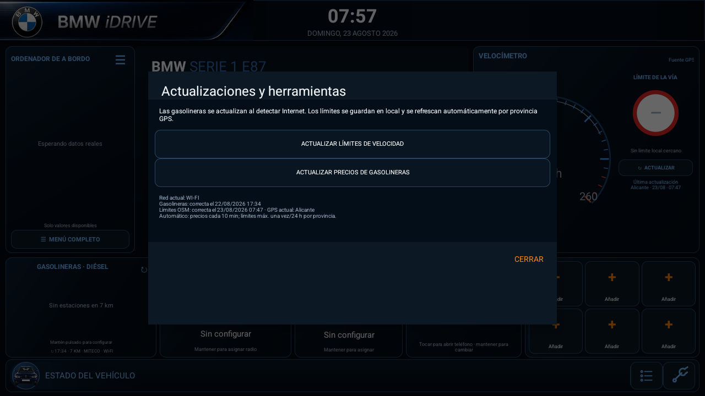
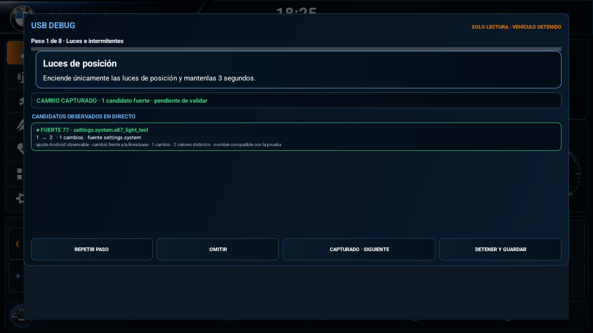
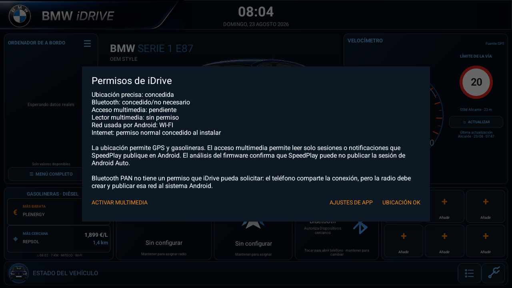

# BMW E87 iDrive

**Español** · [🇬🇧 Read in English](README.md)

[](https://developer.android.com/)
[](#estado-del-proyecto)
[](LICENSE)

**BMW E87 iDrive** es una aplicación Android horizontal para una radio Android de 9 pulgadas instalada en un BMW Serie 1 E87. Proporciona una pantalla de conducción clara, inspirada en iDrive, pero se ejecuta como una aplicación normal: el launcher OEM, CANBUS, MCU, cámara, PDC, climatización y las funciones originales siguen funcionando como antes.

Reúne información de conducción obtenida por GPS, precios españoles de gasolineras cercanas, límites de velocidad guardados localmente, integración multimedia estándar de Android y herramientas de diagnóstico de solo lectura para el entorno JCRK01/CYA/Hiworld identificado en la radio de referencia.

> **Proyecto independiente, no oficial y no comercial.** BMW, iDrive, el emblema BMW y las denominaciones de modelos pertenecen a BMW AG o a sus entidades vinculadas. Se usan únicamente para identificar el vehículo y el contexto técnico; no implican patrocinio ni aprobación. Consulta [NOTICE.md](NOTICE.md) y [LICENSE-ASSETS.md](LICENSE-ASSETS.md).

## Panel principal



El panel está diseñado para pantallas de coche 1280×720 / 16:9. Incluye vehículo central, ordenador de a bordo dinámico, tarjetas de aplicaciones OEM configurables y una fila contextual de estado del vehículo.

### Qué muestra

- **Velocímetro GPS.** GPS es la fuente de velocidad validada en la radio física. La esfera E87 de 0–260 km/h rellena progresivamente solo su aro exterior. Un límite local verificado se marca en naranja y, al superarlo, la cifra y el aro pasan a naranja; sin límite local verificado, ambos se mantienen en verde.
- **Límite de la vía local.** La señal se consulta en una base SQLite local, nunca se descarga durante la conducción. Exige una coincidencia estricta de precisión GPS y tramo próximo; si la vía es ambigua se muestra `—` en lugar de adivinar. Las señales físicas y el cuadro del coche siguen siendo la referencia legal.
- **Ordenador de a bordo dinámico.** Autonomía, consumo medio, temperatura exterior, climatización y otros valores aparecen solo cuando la radio publica una lectura plausible. Si un dato no está disponible se oculta.
- **Gasolineras.** La más barata y la más cercana se calculan respecto al GPS de la radio para el combustible seleccionado. Al pulsar un resultado se navega mediante una aplicación de mapas compatible.
- **Tarjetas OEM.** Radio, Android Auto, teléfono y aplicaciones abren la aplicación OEM asignada. Los metadatos solo aparecen si Android o un servicio OEM los publica realmente.

## Límite de seguridad

| La aplicación hace | La aplicación nunca hace |
|---|---|
| Se ejecuta desde el launcher OEM como app normal | Sustituir el launcher o registrarse como `HOME` |
| Lee GPS, sesiones multimedia Android y getters OEM pasivos verificados | Transmitir CAN, escribir UART o abrir puertos serie |
| Muestra datos expuestos por la unidad y validados | Inventar tramas o mapeos JCRK01/CYA/Hiworld |
| Abre aplicaciones OEM existentes e intents estándar de mapas | Cambiar MCU, Hiworld, fábrica o definición de sockets |
| Exporta diagnóstico a una carpeta USB autorizada | Copiar datos privados, particiones o firmware indiscriminadamente |

Las radios Android aftermarket no comparten un protocolo CAN universal. Un paquete o una clase observados en otra unidad no se convierten en un comando para este coche.

## Funcionalidades

### Conducción e información del vehículo

- GPS como única velocidad visible tras rechazar muestras CAN crudas discordantes detectadas en esta radio.
- Escala real del E87: 0, 20, 40 … 260 km/h, con aro de progreso proporcional y legible. El límite local verificado recibe su propia marca/etiqueta naranja, también para valores como 30, 50, 70, 90, 100 o 120 km/h.
- Autonomía y consumo medio cuando el cuadro OEM publica valores válidos.
- Temperatura exterior mediante HVAC solo cuando su valor es plausible; si no, se oculta.
- Marcha grande dentro de la esfera únicamente si se recibe una marcha actual verificada; no reserva hueco vacío.
- Fila inferior contextual para luces, marcha atrás, freno de mano, cinturón y puertas. Los valores desconocidos o sentinelas se descartan para evitar avisos falsos.
- Botón de mantenimiento verde cuando OEM confirma que no hay avisos, naranja cuando publica uno activo y neutro cuando no existe una fuente verificada.

### Gasolineras, GPS y límites sin conexión

- Diésel y radio de 7 km como valores predeterminados, ambos configurables.
- Precios procedentes del servicio oficial español, filtrados localmente y guardados en una caché de 150 km alrededor del vehículo.
- Los precios próximos se actualizan cada diez minutos mientras la app está visible y Android publica una red IP.
- La APK incorpora semillas compactas de límites para **Alicante, Murcia, Valencia y Albacete**. No descarga una base completa de España.
- La búsqueda de la vía próxima es local y se ejecuta con cada fix GPS de conducción (normalmente alrededor de una vez por segundo); no realiza una consulta de red al cambiar el límite.
- Cada provincia tiene su propia marca de 24 horas: una actualización reciente de Alicante no bloquea una actualización pendiente de Murcia.
- Con GPS y una red Android con Internet, la provincia detectada puede actualizarse automáticamente; también existe selección manual.

### Herramientas, diagnóstico y actualizaciones



La llave inglesa inferior derecha abre tres herramientas separadas:

1. **Debug / USB** — diagnóstico pasivo, pruebas guiadas de correlación, exportación USB y registros de ejecución.
2. **Permisos** — ubicación, dispositivos Bluetooth cercanos y acceso multimedia Android.
3. **Actualizaciones** — actualización de precios y de límites OSM por zona GPS o provincia.

El panel principal muestra provincia, fecha y hora de la última actualización correcta de la base de límites. Antes de instalar una descarga identifica la base local incluida.



USB DEBUG incluye asistentes para puertas, luces, freno de mano, cinturones, marcha atrás/PDC, climatización y pruebas personalizadas. El registro conserva valor bruto, interpretación, fuente, hora y transición anterior → nueva para todas las fuentes disponibles. También puede exportar un inventario OEM y diagnóstico limitado a una carpeta USB elegida por el usuario. Un candidato verde significa *candidato fuerte pendiente de validar*, no un código CAN propietario confirmado.



Ninguna función de diagnóstico transmite tráfico CAN, escribe UART, modifica ajustes OEM ni inicia un servicio de vehículo únicamente para interrogarlo.

### Permisos y conectividad



- **Ubicación** habilita velocidad GPS, límites locales y distancias a gasolineras.
- **Dispositivos cercanos / Bluetooth** se solicita solo cuando Android lo exige para identificar un terminal Bluetooth mediante APIs públicas.
- **Acceso multimedia** permite a Android conceder visibilidad de sesiones o notificaciones estándar. El título y los controles solo aparecen si la fuente publica una sesión controlable.
- **Internet** es un permiso normal concedido durante la instalación; no existe un diálogo posterior para solicitarlo.
- El tethering Bluetooth funciona solo si el firmware de la radio crea y publica una interfaz IP. Emparejar un teléfono, activar Android Auto o activar tethering en el móvil no garantiza que una app normal de la radio reciba Internet.

### Multimedia, radio y teléfono

La cadena multimedia segura es: `MediaSession` de Android, broadcast pasivo verificado de SpeedPlay, puente multimedia OEM de solo lectura y, como último recurso, acceso a notificaciones cuando Android lo permite. Los metadatos y controles se habilitan exclusivamente si la fuente expone una sesión estándar controlable.

El mismo criterio se aplica a FM y Bluetooth: frecuencia, RDS y nombre del terminal se muestran solo si un servicio Android/OEM los publica. iDrive no adivina la emisora ni afirma una conexión telefónica sin una lectura confirmada.

## Instalación y primer uso

1. Descarga la APK adjunta a la última [release de GitHub](../../releases).
2. Cópiala a una memoria USB, instálala en la radio y abre **iDrive** desde el launcher OEM normal.
3. Pulsa la llave inglesa, elige **Permisos** y concede ubicación precisa. Bluetooth cercano y multimedia son opcionales.
4. Espera a que GPS obtenga posición. Velocidad y distancias empiezan a usarla; los límites ya cuentan con la base local incluida.
5. Mantén pulsada una tarjeta para elegir su aplicación OEM. Una pulsación corta abre la asignada.
6. Antes de probar señales del vehículo, selecciona una carpeta USB en **Debug / USB** y exporta una lectura base.

Lee [Pruebas en la radio](docs/PRUEBAS_EN_LA_RADIO.md) antes de realizar pruebas físicas con el vehículo.

## Hardware de referencia

| Elemento | Referencia observada durante la validación |
|---|---|
| Vehículo | BMW 118d E87 LCI, 2010, automático |
| Radio Android | 9 pulgadas, 1280×720, 4/64 GB; comercializada como Android 15 |
| Plataforma efectiva | Rockchip `rk3326_r` / `rk30sdk`, API 30, release declarado 13, 4 GB de RAM, `armeabi-v7a` |
| Software OEM | Jancar IVI Services, `CanBusContentProvider`, `CarService`, `NavigationService`, Autochips |
| MCU | MM40-0-2025.07.23_15:06 |
| Adaptador CAN | Hiworld BM03.10 / familia H1H2BM030A; entorno JCRK01/CYA |
| Perfil configurado | Hiworld BMW X1 2009–2015 All |

Estos datos describen una radio probada; no garantizan que otra radio aparentemente similar sea compatible.

## Arquitectura

| Componente | Responsabilidad |
|---|---|
| `MainActivity` | Interfaz, navegación interna y ciclo de vida visible |
| `VehicleDataRepository` | Agregación prudente y prioridad de fuentes |
| `GpsSpeedProvider` | Posición y velocidad GPS validada |
| `SpeedLimitRepository` | Límites SQLite locales y actualizaciones OSM provinciales |
| `FuelStationProvider` | Precios oficiales, caché local y selección por distancia |
| `JancarCarProvider` | Getters de solo lectura verificados en APK OEM exportadas |
| `MediaSessionProvider` | Metadatos y acciones multimedia estándar cuando se exponen |
| `BluetoothDeviceProvider` / `JancarBluetoothProvider` | Estado Bluetooth público y pasivo verificado |
| `DiagnosticEngine` / `UsbDiagnosticRecorder` | Inspección pasiva, logs y exportación USB controlada |

El proyecto está escrito en Java con APIs del framework Android. No usa dependencias de ejecución de terceros, WebView ni código nativo.

## Privacidad y fuentes de datos

- Precios de carburantes: servicio oficial español de [Precios de carburantes](https://sedeaplicaciones.minetur.gob.es/ServiciosRESTCarburantes/PreciosCarburantes/help).
- Límites: datos `maxspeed` de OpenStreetMap mediante servicios Overpass públicos; consulta [NOTICE.md](NOTICE.md) para atribución y condiciones.
- Las coordenadas del coche no se envían al servicio de precios. El filtrado y las distancias se calculan en la radio. Una app de mapas recibe la coordenada destino solo después de pulsar una gasolinera.
- La app usa exclusivamente la red IP que Android publique: Wi‑Fi, Ethernet o Bluetooth PAN si el firmware de la radio realmente la crea.

## Estado del proyecto

Versión actual: **1.15.2**.

La APK se ha instalado y probado como aplicación normal en la radio de referencia. Funcionan dentro de su límite verificado la velocidad GPS, gasolineras, límites locales, accesos OEM estáticos, diagnóstico USB y valores concretos del ordenador de a bordo.

Aspectos que siguen dependiendo del hardware y no se presentan como universales:

- el significado fino de luces, puertas, cinturón y freno requiere correlación repetida en el vehículo exacto;
- Android Auto/SpeedPlay puede no exponer una sesión multimedia estándar, por lo que título y controles de Spotify pueden seguir sin estar disponibles;
- Internet por Bluetooth PAN depende de que el firmware de la radio publique una interfaz IP;
- RDS, nombre Bluetooth, distancias PDC, RPM y marcha actual requieren un valor vivo y plausible del servicio OEM correspondiente;
- la APK distribuida está firmada para pruebas; para producción sigue siendo necesaria una clave de firma release permanente.

## Compilar desde código fuente

Requisitos: JDK 17 y Android SDK 35.

```powershell
.\gradlew.bat clean lintDebug testDebugUnitTest assembleDebug
```

La APK debug se genera en `app/build/outputs/apk/debug/app-debug.apk`.

Consulta [CHANGELOG.md](CHANGELOG.md), [CONTRIBUTING.md](CONTRIBUTING.md) y [SECURITY.md](SECURITY.md) para historial de versiones, contribuciones y comunicación responsable.

## Licencia y marcas

- Código: [PolyForm Noncommercial License 1.0.0](LICENSE).
- Documentación y recursos originales: [CC BY-NC-SA 4.0](LICENSE-ASSETS.md).
- Marcas de terceros, atribuciones y exclusiones: [NOTICE.md](NOTICE.md).

La licencia permite estudio, modificación y uso no comercial. **No** es una licencia open source aprobada por la OSI y no concede derechos sobre marcas, emblemas o diseños de BMW ni de terceros.

Copyright 2026 Eugenio Moya Pérez.
