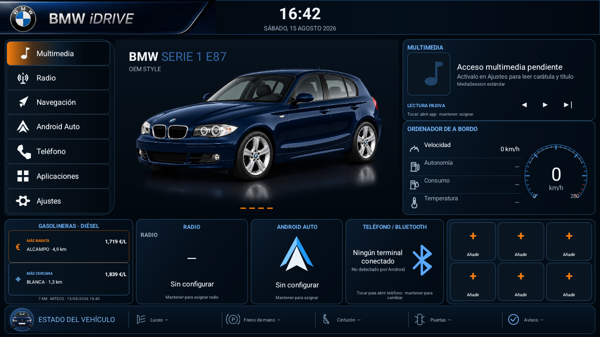

# BMW E87 iDrive

[](https://developer.android.com/about/versions/15)
[](#estado-del-proyecto)
[](LICENSE)

Aplicación Android horizontal para una unidad multimedia de 9 pulgadas instalada en un BMW Serie 1 E87. Ofrece una
interfaz inspirada en iDrive, accesos a las aplicaciones OEM, multimedia mediante APIs públicas de Android, velocidad
GPS, gasolineras cercanas y diagnóstico pasivo del entorno de la radio.

La aplicación se ejecuta **dentro del sistema normal de la radio**. No reemplaza el launcher, no se registra como
`HOME`, no arranca automáticamente y no transmite órdenes al CANBUS o a la MCU.

> **Proyecto independiente y no oficial.** BMW, iDrive, el emblema BMW y las denominaciones de modelos pertenecen a
> BMW AG o a sus entidades vinculadas. Se emplean únicamente para identificar el vehículo y el contexto técnico; no
> implican aprobación ni patrocinio. Las marcas y logotipos de terceros —incluido el emblema usado en el icono— no se
> licencian con este repositorio. Consulta [Avisos y atribuciones](NOTICE.md) y
> [Licencia de recursos](LICENSE-ASSETS.md).



## Estado del proyecto

Versión actual: **1.11.1 — validación previa a hardware**.

El proyecto compila e instala en un emulador Android 15/API 35 a 1280×720. La instalación definitiva en la radio está
pendiente de:

- sustituir la firma debug por una clave release permanente;
- endurecer la caducidad de las posiciones y velocidades GPS;
- corregir el reintento de la primera descarga de gasolineras cuando se interrumpe;
- completar las pruebas físicas de cámara, PDC, climatización, multimedia y CANBUS pasivo.

No se publica por ahora una APK de producción. Los APK locales y las claves de firma están excluidos del repositorio.

## Funcionalidad

- UI 16:9 diseñada para 1280×720, con tema azul marino y acentos BMW/iDrive.
- Aplicación normal accesible desde el launcher OEM.
- Menús y tarjetas configurables para Multimedia, Radio, Navegación, Android Auto/S-Play y Teléfono.
- Seis accesos rápidos configurables a aplicaciones instaladas.
- Lectura opcional de título, artista y carátula mediante `MediaSession`, sin enviar controles multimedia.
- Lectura de emisora/RDS cuando la aplicación de radio lo publica mediante APIs Android estándar.
- Nombre del teléfono cuando Android expone públicamente la conexión Bluetooth.
- Velocidad de vehículo pública cuando Android Automotive la expone, con prioridad sobre el respaldo GPS y fuente
  identificada. El valor y arco son verdes hasta 120 km/h y naranjas por encima.
- Tarjeta de gasolineras con combustible y radio configurables.
- Selección de la estación más barata y la más cercana, calculada localmente respecto al GPS.
- Apertura del destino en Google Maps u otra aplicación compatible.
- Caché móvil de 150 km y actualización local de precios cada diez minutos mientras la app está visible.
- Diagnóstico pasivo de paquetes, componentes, broadcasts y ajustes potencialmente relacionados con JCRK01/CYA.
- `USB DEBUG` con asistente visual paso a paso, candidatos clasificados en directo, selector seguro de carpeta,
  autoguardado cada cinco segundos, copia interna de recuperación e historial persistente de candidatos. La
  clasificación ayuda a interpretar únicamente las señales que JCRK01/CYA exponga realmente a Android; no declara
  códigos propietarios como confirmados ni activa un mapeo automáticamente.
- Sonda opcional, exclusivamente de lectura, para propiedades públicas de Android Automotive.
- Exportación local del informe de diagnóstico.

### Asistente visual USB DEBUG


El color verde significa **candidato fuerte pendiente de validar**, no código CAN confirmado. El archivo exportado
conserva la línea base, los cambios, la fuente y la explicación de la puntuación para poder revisar la captura sin
instalar herramientas auxiliares. Los candidatos medios y fuertes se agregan entre sesiones y pueden consultarse en
`USB DEBUG > Ver candidatos guardados`: tres sesiones fuertes cambian el estado a `LISTO PARA REVISAR`, nunca a
confirmado.

## Principios de seguridad

La integración con el vehículo sigue una regla estricta: **un dato desconocido se muestra como no disponible; nunca se
inventa**.

La aplicación:

- no abre dispositivos CAN, UART o puertos serie;
- no emite broadcasts propietarios;
- no llama a APIs `com.syu`, Microntek, Junsun u otros protocolos no verificados;
- no modifica perfiles Hiworld, MCU, parámetros de fábrica o definición de sockets;
- no intercepta marcha atrás, cámara, PDC, climatización ni audio OEM;
- detiene GPS, Bluetooth, red y diagnóstico cuando deja de estar en primer plano, salvo durante una captura USB
  iniciada expresamente y limitada a diez minutos;
- utiliza Android Automotive únicamente si el sistema ofrece sus APIs públicas y permisos de lectura.

Las cajas CAN y firmwares Android no utilizan un protocolo universal. Un índice o paquete observado en otra plataforma
no es evidencia suficiente para utilizarlo en JCRK01/CYA/Hiworld.

## Hardware de referencia

| Elemento | Referencia conocida |
|---|---|
| Vehículo | BMW 118d E87 LCI, 2010 |
| Equipo OEM | Business CD/AUX, climatización dual y PDC trasero |
| Unidad Android | 9 pulgadas, 1280×720, Android 15, 4/64 GB |
| Plataforma interna | JCRK01/CYA; identificación de SoC pendiente de diagnóstico físico |
| MCU | MM40-0-2025.07.23_15:06 |
| CANBUS | Hiworld BM03.10, familia H1H2BM030A |
| Perfil configurado | Hiworld BMW X1 2009–2015 All |

Estos datos describen la unidad de referencia y no implican compatibilidad automática con otra radio que tenga una
carcasa o nombre comercial similar.

## Arquitectura

| Componente | Responsabilidad |
|---|---|
| `MainActivity` | UI, navegación interna y ciclo de vida visible |
| `VehicleDataRepository` | Agregación segura de fuentes del vehículo |
| `GpsSpeedProvider` | Posición y velocidad mediante `LocationManager` |
| `AndroidAutomotiveProvider` | Sonda pública AAOS de solo lectura |
| `FuelStationProvider` | MITECO, caché, distancias y actualización por provincia |
| `MediaSessionProvider` | Metadatos multimedia y de radio mediante API estándar |
| `BluetoothDeviceProvider` | Estado Bluetooth público, sin escaneo ni conexión |
| `DiagnosticEngine` | Inventario y correlación pasiva del firmware |
| `UsbDebugWizardDialog` | Asistente visual, temporización y candidatos en directo |
| `DiagnosticCandidateClassifier` | Puntuación reproducible sin convertir candidatos en mapeos |
| `DiagnosticCandidateStore` | Historial interno atómico y acotado de evidencias entre sesiones |
| `AppRepository` | Asignación persistente de aplicaciones y accesos rápidos |

El proyecto usa Java y las APIs del framework Android, sin dependencias de ejecución de terceros, WebView ni código
nativo.

## Gasolineras y privacidad

Los precios proceden de los endpoints oficiales de
[Precios de carburantes](https://sedeaplicaciones.minetur.gob.es/ServiciosRESTCarburantes/PreciosCarburantes/help).

- Diésel habitual y 7 km son los valores predeterminados.
- La descarga nacional inicial se filtra en streaming y conserva localmente solo 150 km alrededor del vehículo.
- Las coordenadas del coche no se envían al servicio: el filtrado y las distancias se calculan en la radio.
- Al tocar una estación, solo la coordenada del destino se entrega a la aplicación de mapas.
- La app usa la red predeterminada que Android entregue a la radio. Estar emparejado por Bluetooth no garantiza acceso
  a Internet; el tethering o hotspot debe estar configurado en el sistema.

## Compilación

Requisitos:

- JDK 17.
- Android SDK 35.
- Conexión inicial para descargar Gradle y Android Gradle Plugin.

Linux/macOS:

```bash
./gradlew clean lintDebug testDebugUnitTest assembleDebug
```

Windows:

```powershell
.\gradlew.bat clean lintDebug testDebugUnitTest assembleDebug
```

Salida local:

```text
app/build/outputs/apk/debug/app-debug.apk
```

La variante debug es solo para desarrollo. Una entrega instalable debe generarse como release con una clave privada
permanente que no se almacene en Git.

## Primera configuración

1. Instala una APK release firmada y abre `iDrive` desde el launcher normal de la radio.
2. Concede ubicación para GPS y gasolineras.
3. En Android 12–15, concede `Dispositivos cercanos` si deseas mostrar el terminal Bluetooth.
4. Habilita el acceso a notificaciones solo si deseas leer MediaSession, carátula o RDS publicado.
5. Mantén pulsada una tarjeta para asignar manualmente su aplicación OEM.
6. Exporta el diagnóstico inicial antes de realizar pruebas del vehículo.

La guía completa está en [Pruebas en la radio](docs/PRUEBAS_EN_LA_RADIO.md).

## Rendimiento de referencia

Medido en emulador Android 15/API 35 a 1280×720; la radio física puede comportarse de otra forma.

| Medida | Resultado observado |
|---|---:|
| APK debug | 2.360.999 bytes |
| PSS estabilizado | 45–51 MB |
| PSS con asistente USB activo | 52,5 MB |
| Arranque frío | 1,47–1,53 s |
| Caché Diésel/150 km en Madrid | 143.522 bytes |
| Descarga nacional Diésel | 4.302.377 bytes |
| Actualización de Madrid | 322.345 bytes |

Consulta [Investigación de GitHub y rendimiento](docs/INVESTIGACION_GITHUB_Y_RENDIMIENTO.md) para conocer las
plataformas comparadas y los límites de reutilización.

## Limitaciones conocidas

- Android 15 convencional no equivale a Android Automotive.
- Puertas, luces, cinturón, climatización y PDC suelen llegar a aplicaciones OEM mediante puentes propietarios.
- Una APK instalada por el usuario normalmente no puede obtener permisos AAOS privilegiados para puertas o luces.
- Android Auto o una radio OEM pueden no publicar su reproducción como MediaSession del sistema Android.
- Los perfiles HFP client/A2DP sink utilizados por algunas radios no están expuestos por las APIs Bluetooth públicas.
- El diseño debe validarse con las barras y overlays reales de la unidad Android.

## Contribuciones y seguridad

Lee [CONTRIBUTING.md](CONTRIBUTING.md) antes de proponer cambios. No se aceptarán tramas, índices CAN o APIs
propietarias sin evidencia reproducible de la unidad exacta. Los problemas de seguridad deben comunicarse siguiendo
[SECURITY.md](SECURITY.md), sin publicar datos sensibles del vehículo o del dispositivo.

## Licencia y marcas

- Código fuente: [PolyForm Noncommercial License 1.0.0](LICENSE).
- Documentación y recursos originales: [CC BY-NC-SA 4.0](LICENSE-ASSETS.md).
- Atribuciones, exclusiones y marcas: [NOTICE.md](NOTICE.md).

Esta licencia permite estudio, modificación y uso no comercial, pero **no es una licencia open source aprobada por la
OSI**. La licencia del código y la licencia de recursos no conceden derechos sobre las marcas, emblemas o diseños de
terceros. Para licencias o usos comerciales del código es necesario contactar con el titular del copyright; para usar
marcas de terceros puede ser necesaria además la autorización de sus respectivos titulares.

Copyright 2026 Eugenio Moya Pérez.
