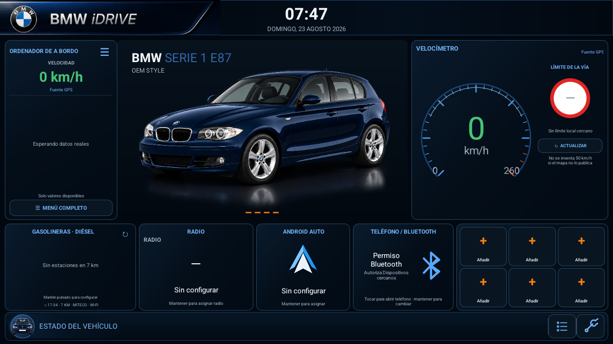
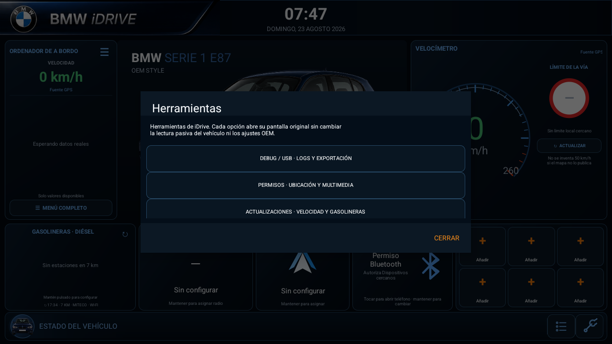
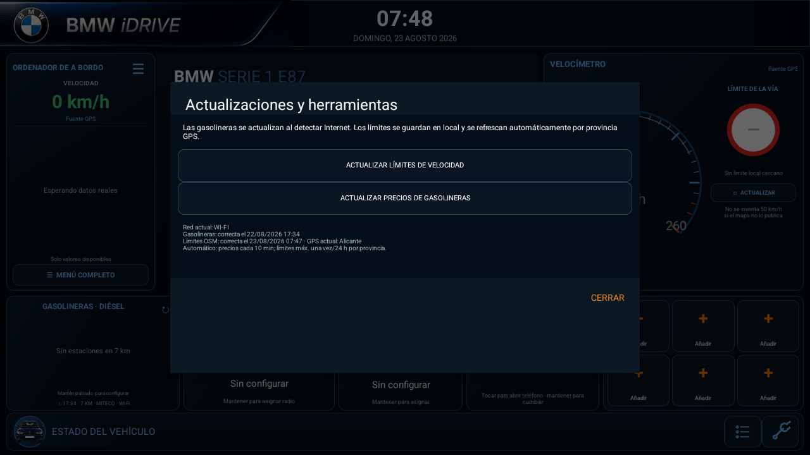

# BMW E87 iDrive

[](https://developer.android.com/)
[](#estado-del-proyecto)
[](LICENSE)

Aplicación Android horizontal para una unidad multimedia de 9 pulgadas instalada en un BMW Serie 1 E87. Ofrece una
interfaz inspirada en iDrive, accesos a las aplicaciones OEM, multimedia mediante APIs públicas de Android, velocidad
GPS, gasolineras cercanas y diagnóstico pasivo del entorno de la radio.

La aplicación se ejecuta **dentro del sistema normal de la radio**. No reemplaza el launcher, no se registra como
`HOME`, no arranca automáticamente y no transmite órdenes al CANBUS o a la MCU.

> **Proyecto independiente y no oficial.** BMW, iDrive, el emblema BMW y las denominaciones de modelos pertenecen a
> BMW AG o a sus entidades vinculadas. Se emplean únicamente para identificar el vehículo y el contexto técnico; no
> implican aprobación ni patrocinio. Las marcas y logotipos de terceros —incluido el emblema usado en el icono— no se
> licencian con este repositorio. Consulta [Avisos y atribuciones](NOTICE.md) y
> [Licencia de recursos](LICENSE-ASSETS.md).

## Capturas actuales · v1.15.1

| Panel principal | Herramientas | Actualizaciones locales |
|---|---|---|
|  |  |  |

La interfaz se ejecuta como una aplicación normal dentro del launcher OEM. El panel mantiene visibles únicamente datos
validados: velocidad GPS, límites OSM locales cuando hay coincidencia, autonomía/consumo/temperatura si las fuentes OEM
los publican y estados de vehículo solo tras confirmación física.

## Estado del proyecto

Versión actual: **1.15.1 — actualización automática local por provincia**.

La APK ya se ha instalado y ejecutado como aplicación normal en la radio física. El diagnóstico identifica una unidad
Rockchip `rk3326_r`, API efectiva 30, 4 GB de RAM y ABI `armeabi-v7a`. El firmware muestra Android 13/15 en distintas
pantallas comerciales, pero la compatibilidad real de la app debe tratarse como Android API 30. Sigue pendiente:

- sustituir la firma debug por una clave release permanente;
- validar en el coche todos los getters pasivos Jancar antes de considerarlos universales;
- confirmar en la unidad si SpeedPlay activa una `MediaSession` durante una conexión Android Auto real;
- completar las pruebas físicas de radio, PDC, climatización y avisos OEM.

La release de GitHub incluye una APK debug firmada para pruebas en la unidad. No es una APK de producción y no contiene
claves de firma privadas del proyecto.

## Funcionalidad

- UI 16:9 diseñada para 1280×720, con tema azul marino y acentos BMW/iDrive.
- Aplicación normal accesible desde el launcher OEM.
- Menús y tarjetas configurables para Multimedia, Radio, Navegación, Android Auto/S-Play y Teléfono.
- Seis accesos rápidos configurables a aplicaciones instaladas.
- Lectura opcional de título, artista y carátula mediante `MediaSession`; play/pausa, anterior y siguiente se envían
  únicamente cuando la sesión activa publica expresamente esas acciones estándar.
- Lectura de emisora/RDS cuando la aplicación de radio lo publica mediante APIs Android estándar.
- Nombre del teléfono mediante perfiles Android públicos o, en esta unidad, mediante los getters de solo lectura
  `getBluetoothState`/`getCurrentDeviceName` verificados en la APK OEM `com.jancar.btservice`.
- Adaptador CAN OEM específico de esta unidad: enlaza, sin iniciarlo, el `CanBusManager` publicado por `com.can.activity`
  y usa exclusivamente callbacks y getters verificados de Dashboard, Cabin, Light, HVAC, Radar/PDC y volante. Puede
  proporcionar autonomía, consumo medio, marcha, temperatura exterior y climatización, además de los campos crudos de
  puertas, cinturones, iluminación y distancias PDC. Los estados solo llegan a la UI cuando su semántica o rango está
  validado; nunca escribe CAN/UART.
- En Debug, `DATOS CAN EN VIVO · FUENTES` permite inspeccionar en un modal los campos no cero de CAN OEM y comparar
  con JCRK01/CYA, Android Automotive y GPS. Incluye actualización en vivo y opción para mostrar ceros; no cambia la
  prioridad automática de la aplicación.
- Adaptador Jancar específico de la unidad que enlaza el `CarService` existente sin iniciarlo y consulta exclusivamente
  getters identificados en la APK exportada. Puede proporcionar velocidad, consumo, RPM, autonomía, temperatura
  exterior, puertas, luces, freno, cinturón, marcha atrás y climatización. No registra callbacks ni escribe CAN/UART.
- Prioridad de velocidad con validación de discrepancias entre CanBusManager OEM, Jancar, Android Automotive público y
  GPS. El valor y arco son verdes hasta 120 km/h y naranjas por encima; una muestra CAN discordante no se pinta como
  velocidad real.
- Base local SQLite de límites de velocidad: durante la conducción solo se consulta `e87_speed_limits.db` en la radio.
  La APK incorpora semillas compactas de Alicante, Murcia, Valencia y Albacete (aprox. 2,1 MB comprimidas). El botón de
  la llave inglesa abre `DEBUG / USB`, `PERMISOS` y `ACTUALIZACIONES`; los límites se actualizan al detectar Internet
  Android y GPS, por provincia (Alicante, Murcia, Valencia o Albacete), sin descargar España completa. Cada provincia
  tiene una cadencia independiente de 24 horas y el panel muestra la última actualización correcta. Si no hay un límite
  local verificado, se muestra `—` y no se inventa una señal.
- Tarjeta de gasolineras con combustible y radio configurables.
- Selección de la estación más barata y la más cercana, calculada localmente respecto al GPS.
- Apertura del destino en Google Maps u otra aplicación compatible.
- Caché móvil de 150 km y actualización local de precios cada diez minutos mientras la app está visible.
- Diagnóstico pasivo de paquetes, componentes, broadcasts y ajustes potencialmente relacionados con JCRK01/CYA.
- `USB DEBUG` con asistente visual paso a paso, candidatos clasificados en directo, selector seguro de carpeta,
  autoguardado cada cinco segundos, copia interna de recuperación e historial persistente de candidatos. La
  clasificación ayuda a interpretar únicamente las señales que JCRK01/CYA exponga realmente a Android; no declara
  códigos propietarios como confirmados ni activa un mapeo automáticamente.
- Botón `EXPORTAR RADIO / CAN` que copia bajo confirmación el inventario y todos los APK instalados identificados por
  sus metadatos como CAN, vehículo, `CarService`, cluster, MCU o marcha atrás. No ejecuta ni enlaza código OEM y limita
  la copia a 100 MB por archivo y 250 MB por sesión.
- Botón independiente `EXPORTACIÓN COMPLETA` para una USB de 20 GB: guarda huella de compilación, parche, kernel,
  funciones, bibliotecas, permisos y componentes; copia todos los APK/splits legibles y los `build.prop`/certificados
  OTA públicos. El límite es 2 GB por archivo y 16 GB en total. No copia datos privados ni particiones, MCU o Hiworld.
- Sonda opcional, exclusivamente de lectura, para propiedades públicas de Android Automotive.
- Ordenador de a bordo dinámico con procedencia explícita para velocidad, autonomía, consumo, temperatura exterior y
  RPM: cualquier campo sin valor real se oculta. La marcha no ocupa una fila; cuando CAN OEM la publica se dibuja en
  grande dentro de la esfera. El informe GPS omite coordenadas y registra proveedor, edad, precisión y velocidad.
- Barra inferior contextual que solo añade luces, marcha atrás, freno, cinturón o puertas cuando su estado requiere
  atención. Un botón de listado abre avisos y mantenimiento: azul sin lectura verificable, verde si la unidad confirma
  que no hay avisos y naranja cuando publica avisos activos. La llave inglesa abre el diagnóstico.
- Centro `PERMISOS` dentro de Diagnóstico: solicita ubicación/Bluetooth, abre el panel de acceso multimedia y ofrece
  acceso directo a los ajustes de la aplicación cuando Android haya bloqueado una petición anterior.
- `EXPORTAR` del diagnóstico escribe el informe y `e87_runtime_session.log` en la USB autorizada; si todavía no hay
  carpeta seleccionada, solicita elegirla y conserva una copia interna de recuperación.

### Asistente visual USB DEBUG


El color verde significa **candidato fuerte pendiente de validar**, no código CAN confirmado. El archivo exportado
conserva la línea base, los cambios, la fuente y la explicación de la puntuación para poder revisar la captura sin
instalar herramientas auxiliares. Los candidatos medios y fuertes se agregan entre sesiones y pueden consultarse en
`USB DEBUG > Ver candidatos guardados`: tres sesiones fuertes cambian el estado a `LISTO PARA REVISAR`, nunca a
confirmado.

## Principios de seguridad

La integración con el vehículo sigue una regla estricta: **un dato desconocido se muestra como no disponible; nunca se
inventa**.

La aplicación:

- no abre dispositivos CAN, UART o puertos serie;
- no emite broadcasts propietarios;
- no llama a APIs `com.syu`, Microntek, Junsun u otros protocolos no verificados;
- no modifica perfiles Hiworld, MCU, parámetros de fábrica o definición de sockets;
- no intercepta marcha atrás, cámara, PDC, climatización ni audio OEM;
- detiene GPS, Bluetooth, red y diagnóstico cuando deja de estar en primer plano, salvo durante una captura USB
  iniciada expresamente y limitada a diez minutos;
- utiliza Android Automotive únicamente si el sistema ofrece sus APIs públicas y permisos de lectura.

Las cajas CAN y firmwares Android no utilizan un protocolo universal. Un índice o paquete observado en otra plataforma
no es evidencia suficiente para utilizarlo en JCRK01/CYA/Hiworld.

## Hardware de referencia

| Elemento | Referencia conocida |
|---|---|
| Vehículo | BMW 118d E87 LCI, 2010 |
| Equipo OEM | Business CD/AUX, climatización dual y PDC trasero |
| Unidad Android | 9 pulgadas, 1280×720, 4/64 GB; comercializada como Android 15 |
| Plataforma efectiva | Rockchip `rk3326_r`/`rk30sdk`, API 30, release declarado `13`, 4 CPU, `armeabi-v7a` |
| Software OEM observado | Jancar IVI Services, `CanBusContentProvider`, `CarService`, `NavigationService` y Autochips |
| MCU | MM40-0-2025.07.23_15:06 |
| CANBUS | Hiworld BM03.10, familia H1H2BM030A |
| Perfil configurado | Hiworld BMW X1 2009–2015 All |

Estos datos describen la unidad de referencia y no implican compatibilidad automática con otra radio que tenga una
carcasa o nombre comercial similar.

## Arquitectura

| Componente | Responsabilidad |
|---|---|
| `MainActivity` | UI, navegación interna y ciclo de vida visible |
| `VehicleDataRepository` | Agregación segura de fuentes del vehículo |
| `JancarCarProvider` | Getters Binder pasivos verificados en la APK de la unidad, sin callbacks ni escrituras |
| `GpsSpeedProvider` | Posición y velocidad mediante `LocationManager` |
| `AndroidAutomotiveProvider` | Sonda pública AAOS de solo lectura |
| `FuelStationProvider` | MITECO, caché, distancias y actualización por provincia |
| `SpeedLimitRepository` | Base SQLite local, consulta por GPS y actualización automática por provincia cuando Android publica Internet |
| `MediaSessionProvider` | Metadatos y controles anunciados por sesiones multimedia Android estándar |
| `BluetoothDeviceProvider` | Estado Bluetooth público, sin escaneo ni conexión |
| `JancarBluetoothProvider` | Nombre/estado del terminal mediante getters Binder OEM verificados y de solo lectura |
| `DiagnosticEngine` | Inventario y correlación pasiva del firmware |
| `OemPackageInspector` | Metadatos OEM dirigidos y selección segura de APK CAN/vehículo para USB |
| `UsbDiagnosticRecorder` | TXT, recuperación interna y copia binaria acotada a una carpeta autorizada |
| `UsbDebugWizardDialog` | Asistente visual, temporización y candidatos en directo |
| `DiagnosticCandidateClassifier` | Puntuación reproducible sin convertir candidatos en mapeos |
| `DiagnosticCandidateStore` | Historial interno atómico y acotado de evidencias entre sesiones |
| `AppRepository` | Asignación persistente de aplicaciones y accesos rápidos |

El proyecto usa Java y las APIs del framework Android, sin dependencias de ejecución de terceros, WebView ni código
nativo.

## Gasolineras y privacidad

Los precios proceden de los endpoints oficiales de
[Precios de carburantes](https://sedeaplicaciones.minetur.gob.es/ServiciosRESTCarburantes/PreciosCarburantes/help).

- Diésel habitual y 7 km son los valores predeterminados.
- La descarga nacional inicial se filtra en streaming y conserva localmente solo 150 km alrededor del vehículo.
- Las coordenadas del coche no se envían al servicio: el filtrado y las distancias se calculan en la radio.
- Al tocar una estación, solo la coordenada del destino se entrega a la aplicación de mapas.
- La app usa la red IP que Android entregue a la radio, sea Wi-Fi, Ethernet o Bluetooth PAN. Estar emparejado por
  Bluetooth no garantiza acceso a Internet; el tethering o hotspot debe estar configurado y publicado por el sistema OEM.
- `INTERNET` es un permiso normal concedido durante la instalación: no existe un diálogo adicional que la app pueda
  solicitar. Para usar Bluetooth PAN, la radio debe crear y publicar esa interfaz de red a Android.

## Límites de velocidad locales

La base de límites de velocidad se crea en el almacenamiento privado de la aplicación como `e87_speed_limits.db` e incorpora
semillas provinciales de Alicante, Murcia, Valencia y Albacete. No se consulta Internet durante la conducción: la UI busca el
tramo más cercano en esa base local. Mientras iDrive está visible, al recibir GPS e Internet Android identifica la provincia
actual —prioriza la carretera OSM local y usa la zona GPS como respaldo— y puede refrescar solo esa provincia. Cada provincia
tiene su propia marca de actualización correcta: Alicante actualizado hace menos de 24 h no bloquea una descarga pendiente de
Murcia, Valencia o Albacete. Desde la llave inglesa > `ACTUALIZACIONES` se puede elegir manualmente una zona de 5 km o una
provincia; el panel muestra red, provincia GPS y fecha/hora de la última actualización satisfactoria. Si falla una descarga,
conserva los datos anteriores y sigue funcionando sin conexión. Los datos de `maxspeed` se obtienen de OpenStreetMap mediante
un servicio Overpass público, por lo que su disponibilidad y cobertura dependen de esos servicios y de la cartografía local.

La atribución de OpenStreetMap y sus condiciones de uso están documentadas en [Avisos y atribuciones](NOTICE.md).

## Compilación

Requisitos:

- JDK 17.
- Android SDK 35.
- Conexión inicial para descargar Gradle y Android Gradle Plugin.

Linux/macOS:

```bash
./gradlew clean lintDebug testDebugUnitTest assembleDebug
```

Windows:

```powershell
.\gradlew.bat clean lintDebug testDebugUnitTest assembleDebug
```

Salida local:

```text
app/build/outputs/apk/debug/app-debug.apk
```

La variante debug es solo para desarrollo. Una entrega instalable debe generarse como release con una clave privada
permanente que no se almacene en Git.

## Primera configuración

1. Instala la APK de pruebas firmada y abre `iDrive` desde el launcher normal de la radio.
2. Abre `Diagnóstico > PERMISOS` y concede ubicación para GPS y gasolineras.
3. En Android 12–15, concede `Dispositivos cercanos` si deseas mostrar el terminal Bluetooth.
4. Desde `PERMISOS > ACTIVAR MULTIMEDIA`, habilita `iDrive · multimedia` si deseas leer y controlar las acciones que
   publique una `MediaSession`.
5. Mantén pulsada una tarjeta para asignar manualmente su aplicación OEM.
6. Exporta el diagnóstico inicial antes de realizar pruebas del vehículo.

La guía completa está en [Pruebas en la radio](docs/PRUEBAS_EN_LA_RADIO.md).

## Rendimiento de referencia

Medido en emulador Android 15/API 35 a 1280×720 y, donde se indica, en la unidad física.

| Medida | Resultado observado |
|---|---:|
| APK debug v1.13.1 | 2.395.745 bytes |
| APK debug v1.13.4 | 2.417.374 bytes; SHA-256 `9533944861E8C7EAC6DCD5BE19CA2DFB03BE1D39C4499D5D2751A6B36402DD20` |
| APK debug v1.13.5 | 2.419.211 bytes; SHA-256 `0E0CFAB6684C14208C46E0611E5A27D388E89B1E7AECC5D7C0851BC8F43BB239` |
| APK debug v1.14.0 | 2.446.214 bytes; SHA-256 `DA5DF33223FEF124AA6A3152487FFA29DAB395536A881985660F58ABBB4546EF` |
| APK debug v1.14.1 | 2.656.036 bytes; SHA-256 `8CD5571A778E9712A3FA041B29BC33475BC6A3500B7996BFD3910312CAEBE6CA` |
| APK debug v1.15.1 | 4.880.249 bytes; SHA-256 `0B3AE9F7D8B1A5DBAC7829A72D88236D3CBD6A5642B6067BC9C3AC9BFAE95DB1` |
| PSS estabilizado | 45–51 MB |
| PSS con asistente USB activo | 52,5 MB |
| PSS observado en radio física | 42,4–45,0 MB |
| Heap por aplicación en radio | 192 MB |
| RAM física detectada | 4.096 MB |
| Arranque frío | 1,47–1,53 s |
| Caché Diésel/150 km en Madrid | 143.522 bytes |
| Descarga nacional Diésel | 4.302.377 bytes |
| Actualización de Madrid | 322.345 bytes |

Consulta [Investigación de GitHub y rendimiento](docs/INVESTIGACION_GITHUB_Y_RENDIMIENTO.md) para conocer las
plataformas comparadas y los límites de reutilización.

## Limitaciones conocidas

- La unidad física no declara Android Automotive y su API efectiva 30 no coincide con su versión comercial.
- Los getters Jancar integrados son específicos del firmware exportado y requieren validación física señal por señal.
- PDC solo se presenta activo cuando `RadarInfo` publica su indicador; sus distancias y la temperatura de motor no se
  presentan como valores finales hasta identificar una escala inequívoca y segura.
- Una APK instalada por el usuario normalmente no puede obtener permisos AAOS privilegiados para puertas o luces.
- Android Auto o una radio OEM pueden no publicar su reproducción como MediaSession del sistema Android. La radio
  Jancar observada no publicó emisora ni RDS por ese mecanismo durante la exportación.
- Los perfiles HFP client/A2DP sink utilizados por algunas radios no están expuestos por las APIs Bluetooth públicas.
- El diseño debe validarse con las barras y overlays reales de la unidad Android.

## Contribuciones y seguridad

Lee [CONTRIBUTING.md](CONTRIBUTING.md) antes de proponer cambios. No se aceptarán tramas, índices CAN o APIs
propietarias sin evidencia reproducible de la unidad exacta. Los problemas de seguridad deben comunicarse siguiendo
[SECURITY.md](SECURITY.md), sin publicar datos sensibles del vehículo o del dispositivo.

## Licencia y marcas

- Código fuente: [PolyForm Noncommercial License 1.0.0](LICENSE).
- Documentación y recursos originales: [CC BY-NC-SA 4.0](LICENSE-ASSETS.md).
- Atribuciones, exclusiones y marcas: [NOTICE.md](NOTICE.md).

Esta licencia permite estudio, modificación y uso no comercial, pero **no es una licencia open source aprobada por la
OSI**. La licencia del código y la licencia de recursos no conceden derechos sobre las marcas, emblemas o diseños de
terceros. Para licencias o usos comerciales del código es necesario contactar con el titular del copyright; para usar
marcas de terceros puede ser necesaria además la autorización de sus respectivos titulares.

Copyright 2026 Eugenio Moya Pérez.
