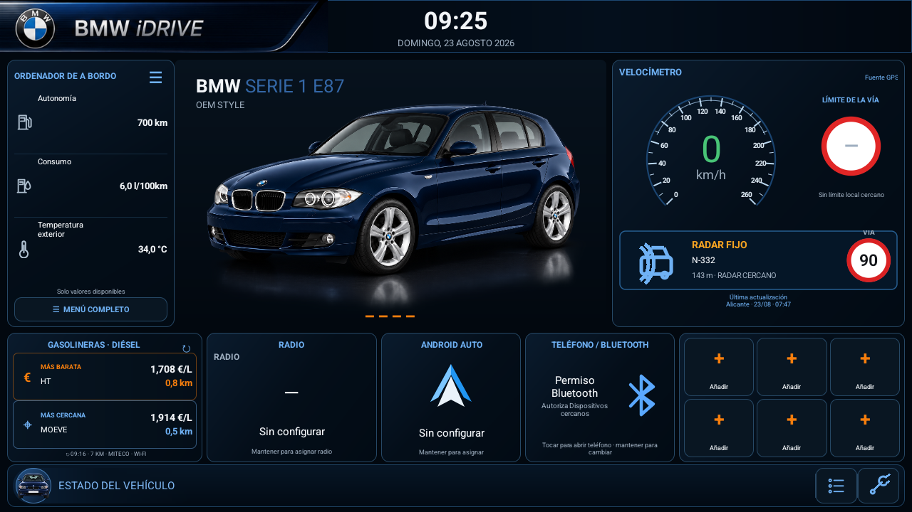
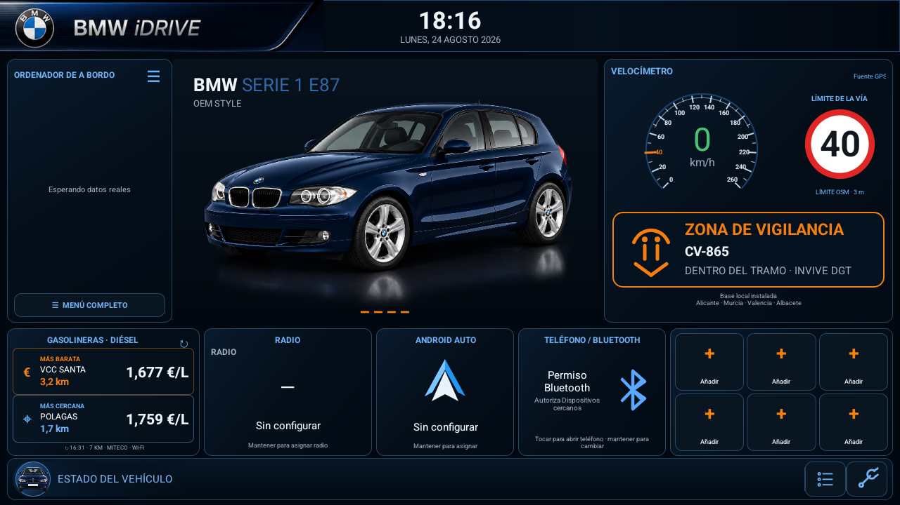
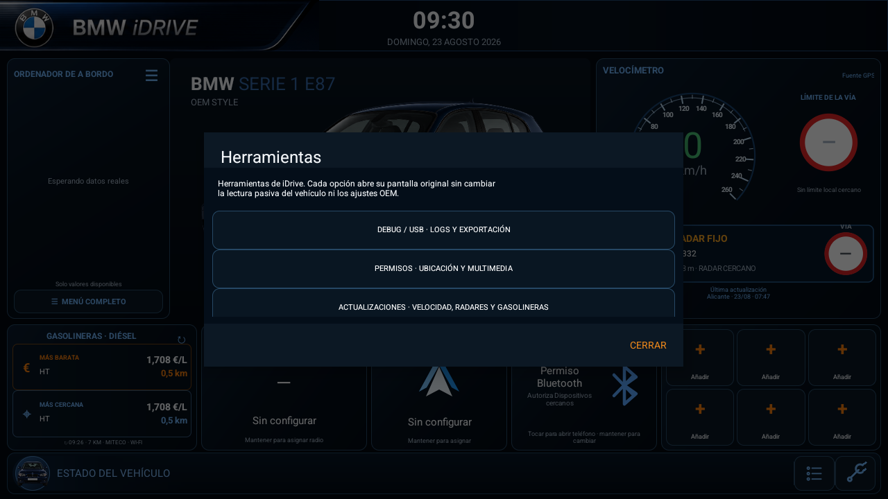
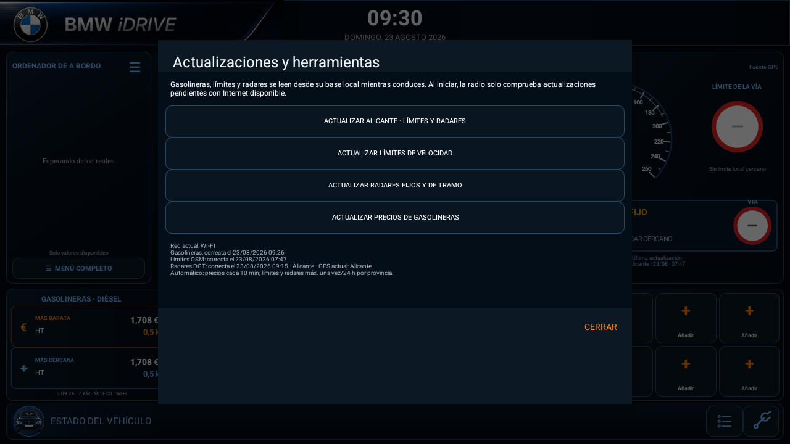

# BMW E87 iDrive

[🇪🇸 Leer en español](README.es.md) · **English**

[](https://developer.android.com/)
[](#project-status)
[](LICENSE)

**BMW E87 iDrive** is a landscape Android dashboard application for a 9-inch aftermarket head unit installed in a BMW 1 Series E87. It provides a clear, iDrive-inspired driving screen while remaining a normal Android application: the OEM launcher, CANBUS box, MCU, camera, PDC, climate controls and factory functions keep operating as before.

It combines GPS-backed driving information, nearby Spanish fuel prices, locally stored speed limits, standard Android media integration and a read-only diagnostic toolkit for the JCRK01/CYA/Hiworld environment identified on the reference unit.

> **Independent, unofficial and non-commercial project.** BMW, iDrive, the BMW roundel and model names are trademarks of BMW AG or its affiliates. They identify the vehicle context only and do not imply sponsorship or endorsement. See [NOTICE.md](NOTICE.md) and [LICENSE-ASSETS.md](LICENSE-ASSETS.md).

## Main dashboard



*Emulator documentation simulation: 700 km range, 6.0 l/100 km average consumption, 34 °C exterior temperature and a nearby fixed camera. The radio only shows values its real sources publish.*

The dashboard targets 1280×720 / 16:9 automotive displays. It has a central vehicle image, a dynamic trip-computer panel, configurable OEM app cards and a contextual vehicle-status strip.

### What it shows

- **GPS speedometer.** GPS is the validated speed source on the physical radio. The E87-style 0–260 km/h dial progressively fills its outer ring. A verified local road limit is marked in orange and the speed value/progress ring turn orange only once it is exceeded; without a verified local limit, both remain green.
- **Local road limit.** The traffic sign is looked up in a local SQLite database, never fetched while driving. A red circle is only an explicit OSM `maxspeed`; a blue square is conservative class-based guidance after a local GPS-area update, never a legal limit or orange speedometer trigger. Physical signs and the vehicle's instruments remain the legal reference.
- **Dynamic trip computer.** Range, average consumption, exterior temperature, climate values and other data are shown only when the radio provides a plausible reading. Unavailable data is hidden.
- **Fixed and section camera warning.** The APK carries the national DGT inventory locally. The panel appears only for a nearby fixed/section camera while distance decreases, then disappears when the vehicle moves away. Mobile controls are intentionally excluded. Optional speech is emitted once only for a DGT **fixed** camera and never requests audio focus. The circular value is the verified **road** limit from the local map, not an invented radar limit.
- **INVIVE watch zones.** A separate `SPEED WATCH ZONE` card appears when approaching or driving through an official intensified-enforcement section. It is never rendered as a camera, never triggers fixed-camera speech and never supplies a legal speed limit; the speed sign remains sourced exclusively from the local road map.


- **Fuel stations.** The cheapest and nearest station are calculated against the radio GPS position for the selected fuel. Press a result to navigate using a compatible installed maps app.
- **OEM app cards.** Radio, Android Auto, phone and app cards open their assigned OEM applications. Metadata is displayed only when Android or an OEM service actually publishes it.

## Safety boundary

| The app does | The app never does |
|---|---|
| Runs as a normal app opened from the OEM launcher | Replace the launcher or register as `HOME` |
| Reads GPS, standard Android media sessions and verified OEM read-only getters | Transmit CAN, write UART or open serial devices |
| Shows only values exposed by the unit and validated by range/correlation | Invent JCRK01/CYA/Hiworld protocol frames or mappings |
| Opens existing OEM apps and standard map intents | Change MCU, factory, Hiworld or socket settings |
| Exports diagnostics to a user-approved USB folder | Copy private app data, partitions or firmware indiscriminately |

Aftermarket head units do not share a universal CAN protocol. A package or class observed on another unit is not treated as a vehicle command on this one.

## Features

### Driving information and vehicle state

- GPS as the sole visible speed source after rejecting inconsistent raw CAN speed samples found on this radio.
- E87-style 0, 20, 40 … 260 km/h scale with an easily readable proportional progress ring. A verified local limit receives its own orange tick/label, including limits such as 30, 50, 70, 90, 100 or 120 km/h.
- Range and average consumption when the OEM dashboard publishes valid values.
- Exterior temperature from HVAC only when its value is plausible; otherwise it remains hidden.
- Large gear indicator inside the dial only if an actual current gear is verified; it does not reserve empty space.
- Contextual lower strip for lights, reverse, parking brake, belt and doors. Unknown/sentinel values are discarded so false alerts are not shown.
- Maintenance button: green when OEM confirms no notice, orange when it publishes an active notice, neutral when no verified notice feed exists.

### Fuel prices, GPS and offline speed limits

- Diesel and a 7 km working radius by default; both are configurable.
- Fuel prices come from the official Spanish service, are filtered locally and cached within 150 km of the vehicle.
- Nearby prices refresh every ten minutes while the app is visible, when Android exposes an IP network.
- The APK includes a complete drivable-road map for **Alicante**: classes for **112,709** roads, generic `maxspeed` values and 89 geometries carrying `maxspeed:forward/backward`. Position, heading and continuity select the road first; only then is the best value for that same road and direction applied. Murcia, Valencia and Albacete keep their compact seeds.
- The first run also works offline with the dated official Alicante diesel-price snapshot bundled in the APK. Once Internet becomes available, the normal Ministry endpoint replaces that seed cache.
- The APK also includes the compact national DGT DATEX II inventory of fixed and section cameras (about 2 MB before compression). Camera matching remains entirely local while driving; it never queries a radar service on each GPS fix.
- It also includes the national DGT DATEX II **INVIVE** inventory. INVIVE identifies intensified speed-enforcement sections, not cameras or speed limits. Detection combines the official road with the local OSM road reference and geometry to reduce matches against parallel roads.
- The nearby-road lookup is local and runs with each driving GPS fix (normally about once per second); it does not make a network request when the limit changes.
- OSM keeps the provincial Alicante scope and its anti-abuse window. Official DGT layers
  (TN-ITS limits, cameras and INVIVE) are downloaded at national scope and queried locally
  afterwards. Each successful source update has its own 24-hour guard; fuel prices keep their
  ten-minute automatic refresh policy.
- **Update all** opens a sequential modal with one progress row per source and a final local
  consolidation step. OSM Alicante, fuel prices, DGT cameras, DGT limits and INVIVE can also be
  updated individually. Each row shows the date and time of its latest successful download.

### Tools, diagnostics and updates



The lower-right gear opens three separate tools:

1. **Debug / USB** — passive diagnostics, guided correlation tests, USB export and runtime logs.
2. **Permissions** — location, nearby Bluetooth devices and Android media access.
3. **Updates** — one button to update everything, plus individual buttons for OSM Alicante,
   fuel prices, DGT cameras, DGT limits and INVIVE. OSM is the only partial download; official
   layers are stored nationally. Import and consolidation run locally and replace only iDrive's
   own caches.

The dashboard shows the province, date and time of the latest successful speed-map update. Before an update is installed, it identifies the bundled local base.



USB DEBUG supports guided checks for doors, lights, parking brake, belts, reverse/PDC, climate and custom observations. It records raw values, interpretation, source, timestamp and previous → new value for all available sources. An optional privacy switch can add precise GPS coordinates to the runtime log for road-limit diagnostics; it is disabled by default, persists until switched off and is clearly recorded in every exported report. It can also export a bounded OEM inventory and diagnostic log to a folder selected by the user. A green candidate is only a *strong candidate awaiting validation*; it is never a confirmed proprietary CAN code.


No diagnostic feature sends CAN traffic, writes UART, changes OEM settings or starts an OEM vehicle service solely to interrogate it.

### Permissions and connectivity


- **Location** enables GPS speed, local road limits and fuel-station distances.
- **Nearby devices / Bluetooth** is requested only when Android requires it to identify a connected Bluetooth device through public APIs.
- **Media access** allows Android to grant visibility to standard sessions or notifications. Playback title and controls appear only if the source exposes a controllable session.
- **Internet** is a normal install-time Android permission; there is no runtime dialog for it.
- Bluetooth tethering works only if the radio firmware creates and publishes an IP interface. Pairing a phone, enabling Android Auto or enabling tethering on the phone does not itself guarantee Internet access to a normal app on the head unit.

### Media, radio and phone integration

The safe media fallback chain is: Android `MediaSession`, verified passive SpeedPlay broadcast, read-only OEM media bridge, then notification access where Android permits it. The app displays metadata and enables controls only when a controllable standard session is exposed.

The same rule applies to FM and phone information. Frequency, RDS station name and Bluetooth terminal name are presented only if an Android/OEM service publishes them; iDrive does not guess a station name or connection state.

### INVIVE source

INVIVE is integrated from the [official DGT NAP dataset](https://nap.dgt.es/en/dataset/tramos-invive), with attribution and update timestamp exposed in diagnostics. The app never converts these sections into fixed cameras or infers a speed limit from them.

## Installation and first use

1. Download the APK attached to the latest [GitHub release](../../releases).
2. Copy it to a USB drive, install it on the head unit and open **iDrive** from the normal OEM launcher.
3. Open the gear, choose **Permissions** and grant precise location. Nearby-device and media access are optional.
4. Wait for GPS to acquire a position. Speed and station distances start using it; speed-limit data already has the bundled local base.
5. Long-press a card to choose its OEM application. A short press opens the selected app.
6. Before testing vehicle signals, select a USB folder in **Debug / USB** and export a baseline report.

Read [Testing on the head unit](docs/PRUEBAS_EN_LA_RADIO.md) before performing physical vehicle tests.

## Reference hardware

| Item | Reference observed during validation |
|---|---|
| Vehicle | BMW 118d E87 LCI, 2010, automatic |
| Android head unit | 9-inch, 1280×720, 4/64 GB, marketed as Android 15 |
| Effective platform | Rockchip `rk3326_r` / `rk30sdk`, API 30, declared release 13, 4 GB RAM, `armeabi-v7a` |
| OEM software | Jancar IVI Services, `CanBusContentProvider`, `CarService`, `NavigationService`, Autochips |
| MCU | MM40-0-2025.07.23_15:06 |
| CAN adapter | Hiworld BM03.10 / H1H2BM030A family; JCRK01/CYA environment |
| Configured profile | Hiworld BMW X1 2009–2015 All |

These details describe one tested radio, not a guarantee that a similar-looking unit is compatible.

## Architecture

| Component | Responsibility |
|---|---|
| `MainActivity` | Dashboard UI, internal navigation and visible lifecycle |
| `VehicleDataRepository` | Conservative aggregation and source priority |
| `GpsSpeedProvider` | GPS position and validated speed |
| `SpeedLimitRepository` | Local SQLite limits and per-province OSM updates |
| `DgtSpeedRepository` | National weekly DGT limit delta, history and local road/direction matching |
| `RadarRepository` | Local DGT fixed/section camera cache and 24-hour provincial updates |
| `InviveRepository` | National DGT INVIVE watch-zone cache, separate from cameras and limits |
| `FuelStationProvider` | Official fuel prices, local cache and distance selection |
| `JancarCarProvider` | Verified read-only getters from exported OEM packages |
| `MediaSessionProvider` | Standard media metadata and actions when exposed |
| `BluetoothDeviceProvider` / `JancarBluetoothProvider` | Public and verified passive Bluetooth state |
| `DiagnosticEngine` / `UsbDiagnosticRecorder` | Passive inspection, logs and controlled USB export |

The project is written in Java with Android framework APIs. It has no runtime third-party dependency, WebView or native code.

## Privacy and data sources

- Fuel prices: official Spanish [Fuel Prices service](https://sedeaplicaciones.minetur.gob.es/ServiciosRESTCarburantes/PreciosCarburantes/help).
- Speed limits: OpenStreetMap `maxspeed` data through public Overpass services; see [NOTICE.md](NOTICE.md) for attribution and terms.
- Fixed and section cameras: official [DGT DATEX II publication](https://infocar.dgt.es/datex2/dgt/PredefinedLocationsPublication/radares/content.xml), locally cached. Mobile controls are not part of the feature.
- Official speed limits: the [DGT weekly TN-ITS speed-limit feed](https://infocar.dgt.es/tnits/limitesVelocidad.xml). The APK installs the national snapshot available at build time and merges later changes into SQLite without discarding history.
- Watch zones: the [DGT/NAP INVIVE dataset](https://nap.dgt.es/en/dataset/tramos-invive), stored as watch zones and never as fixed cameras.
- Vehicle coordinates are not sent to the fuel-price service. Filtering and distance calculations run on the head unit. A map app receives the destination coordinate only after the user presses a station.
- The app uses only an IP network Android exposes: Wi-Fi, Ethernet or Bluetooth PAN if the radio firmware truly publishes it.

## Project status

Current version: **1.24.2**.

The APK has been installed and exercised as a normal application on the reference radio. GPS speed, fuel stations, local map limits, local DGT fixed/section-camera matching, INVIVE watch zones, static OEM shortcuts, USB diagnostics and selected trip-computer values work within their verified boundary. Version 1.24.2 adds a resilient offline radar-seed parser and a repeatable GeoJSON/OSRM route-replay QA tool. DGT data wins only after road, geometry and direction matching; OSM follows, and the blue class-based sign remains the final visual fallback. The emulator route QA validates GPS, local limit matching, radar panels and the bundled fuel seed; CAN, Android Auto, Bluetooth PAN and voice remain hardware-dependent validations.

Hardware-dependent items that remain deliberately unclaimed as universal:

- fine-grained lights, doors, belt and parking-brake semantics require repeated correlation on the exact vehicle;
- Android Auto/SpeedPlay may not expose a standard media session, so Spotify title and controls may remain unavailable;
- Bluetooth PAN Internet depends on the radio firmware publishing an IP interface;
- RDS, Bluetooth terminal name, PDC distances, RPM and live gear require a plausible value from the relevant OEM service;
- the distributed APK is debug-signed for testing; a permanent release signing key is still needed for production distribution.

## Build from source

Requirements: JDK 17 and Android SDK 35.

```powershell
.\gradlew.bat clean lintDebug testDebugUnitTest assembleDebug
```

The debug APK is generated at `app/build/outputs/apk/debug/app-debug.apk`.

See [CHANGELOG.md](CHANGELOG.md), [CONTRIBUTING.md](CONTRIBUTING.md) and [SECURITY.md](SECURITY.md) for release history, contributions and responsible reporting.

## License and trademarks

- Source code: [PolyForm Noncommercial License 1.0.0](LICENSE).
- Original documentation and assets: [CC BY-NC-SA 4.0](LICENSE-ASSETS.md).
- Third-party trademarks, attribution and exclusions: [NOTICE.md](NOTICE.md).

The code license allows study, modification and non-commercial use. It is **not** OSI-approved open source and grants no rights to BMW or other third-party trademarks, emblems or designs.

Copyright 2026 Eugenio Moya Pérez.
